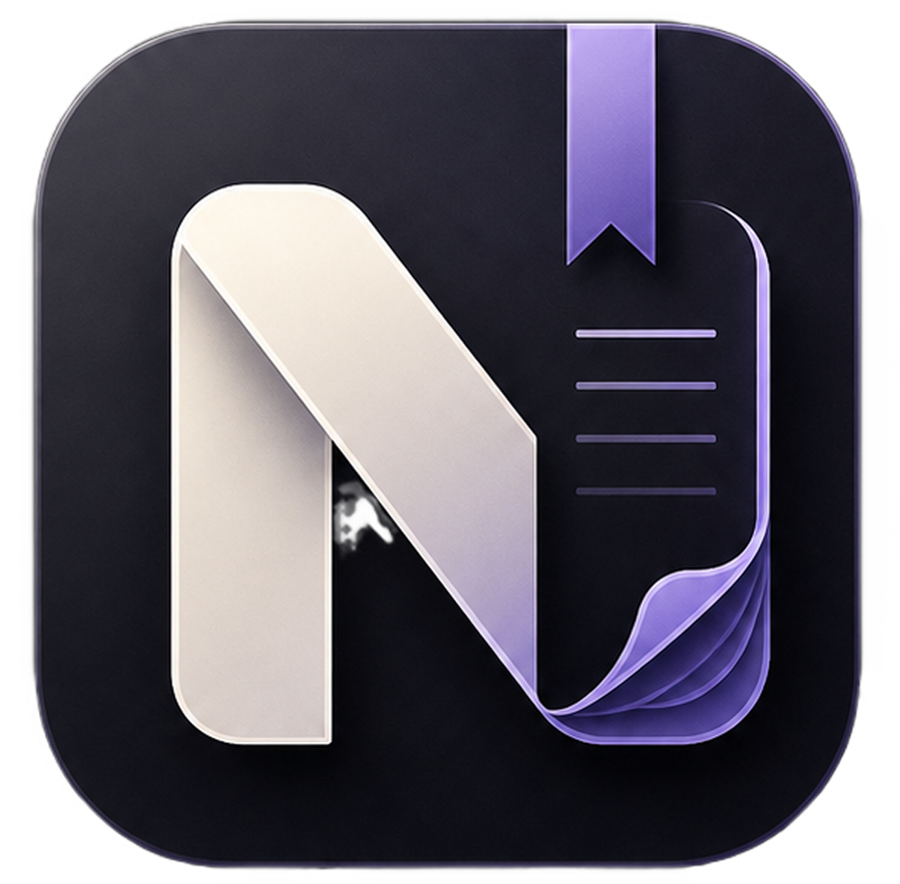

<div align="center">
  
  <h1>Notoir</h1>
  <p><strong>A beautifully designed, local-first note-taking and knowledge management desktop application.</strong></p>
  <p><em>Built by Dev. P</em></p>
</div>

---

## 🌟 Introduction

Notoir is a premium note-taking application designed for productivity enthusiasts and developers alike. It offers a seamless experience with features like a markdown editor, folder organization, tag management, daily journaling, task tracking, and an interactive knowledge graph.

Built with **React**, **Vite**, **TypeScript**, and **Electron**, Notoir supports dual storage modes:
- **Personal Mode (Managed)**: A zero-setup cloud syncing mode powered by a managed MongoDB cluster.
- **Developer Mode**: Bring your own database (supports local/remote MongoDB or PostgreSQL) for complete ownership over your data.

## 🚀 For Users

You can find the latest executables in the `release/` folder after a successful build. 

There are two primary ways to run Notoir on Windows:
1. **`Notoir-Setup.exe` (Recommended)**: This runs a full installation on your system. It is the recommended choice because it fully syncs with your operating system, handles desktop shortcuts, and registers file associations (so you can open `.md` or `.txt` files directly with Notoir).
2. **`Notoir.exe` (Portable)**: This is a portable executable designed for right-away use. You can run it from a USB drive or immediately without installing anything, but it will not register file associations with your operating system.

## 💻 For Developers

Want to contribute to Notoir or build it from source? Follow these steps to get started!

### 1. Clone the Repository
```bash
git clone https://github.com/your-username/notoir.git
cd notoir
```

### 2. Environment Setup (CRITICAL)
Before you run or build the application, you **must** create a `.env` file in the root directory. This provides the application with the default connection strings needed for the Managed Storage mode.

Create a file named `.env` and add your cluster URI:
```env
MONGODB_URI=mongodb+srv://<username>:<password>@cluster0.your-cluster.mongodb.net/notoir?retryWrites=true&w=majority&appName=Cluster0
```
*(Note: The `.env` file is intentionally ignored in `.gitignore` to prevent you from accidentally committing your secrets to GitHub).*

### 3. Install Dependencies
```bash
npm install
```

### 4. Development Server
Run the local development server (this will boot both the Vite React server and the Electron application):
```bash
npm run dev
```

### 5. Build for Production
To package the app into standard Windows executables:
```bash
npm run package
```
This will compile the TypeScript code and use `electron-builder` to generate the `.exe` files inside the `release/` directory.
